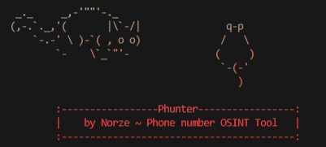

<h1 align="center" id="title">🐁🐈 Phunter</h1>

<p align="center">
	
</p>

[](https://www.python.org/downloads/)
[](https://www.gnu.org/licenses/gpl-3.0.fr.html)

# **😇 About Phunter**
**Phunter is a tool a very useful tool for finding information about a phone number**

**The hunting cat is able to find :**
- operator
- possible(s) location(s)
- line type 
- reputation
- various scraped information
- spammer or not
- connect to amazon or not
- owner


## **📦 Installation**

- [Python 3](https://www.python.org/downloads/)
- [Git](https://git-scm.com/downloads)

```
$ git clone https://github.com/N0rz3/GitSint.git
$ cd ./Phunter
$ pip3 install -r requirements.txt
```

## **🎲 Usage**

```
usage: phunter.py [-h] [-t [TARGET]] [-a [AMAZON]] [-p [PERSON]] [-f [FILE]] [-v] [-o [OUTPUT]]

options:
  -h, --help            show this help message and exit
  -t [TARGET], --target [TARGET]
                        get info by phone number
  -a [AMAZON], --amazon [AMAZON]
                        get confirmation whether Amazon linked by phone number
  -p [PERSON], --person [PERSON]
                        get owner of phone number with inversed annual (Page Blanche)
  -f [FILE], --file [FILE]
                        get info by a file containing phone numbers
  -v, --verify          check your version, update(s), services...
  -o [OUTPUT], --output [OUTPUT]
                        save your results in file (only with args: --amazon/-a , --person/-p)
```

### Example usages:

- `$ python3 phunter.py -t +33666666666` or with file `$ python3 phunter.py -f file.txt`

- `$ python3 phunter.py -a +33666666666` or with output `$ python3 phunter.py -a +33666666666 -o output.txt`

### Example results:


**🛑 With option `-p` you will have to accept the conditions and refuse the notifications, you must be present when this option is executed**

## 🌞 More

### **🗿 Contributions**
Make a [pull requests](https://github.com/N0rz3/Phunter/pulls) with all the details needed to contribute

### **✔️ / ❌ Rules**

**this tool was designed for educational purposes only and is not intended for any mischievous use, I am not responsible for its use.**

### **📜 License**

**This project is [License GPL v3](https://www.gnu.org/licenses/gpl-3.0.fr.html) be sure to follow all rules 👍**

### **💖 Thanks**
- If you like what i do please subscribe 💖. And if you find this tool is useful don't forget to star 🌟

**💶 Support me 👇**

<a href="https://www.buymeacoffee.com/norze" target="_blank"></a> 
